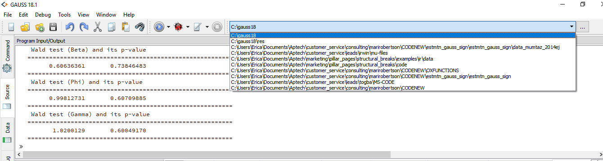

# gauss-panel-library
[![alt text][1.1]][1]
[![alt text][2.1]][2]
[![alt text][3.1]][3]

# GAUSS panel data library
This is an early stage library of panel data procedures for estimation and data management. The program are in pre-release form and as such there is no library folder for installation yet.

## Getting Started
### Prerequisites
The program files require a working copy of **GAUSS 18+**. Many can be run on earlier versions with some small revisions.

### Installation
These files such be downloaded to a directory which should be set to the working directory. If the hierarchy of this repository is maintained you should be able to run the examples by setting the gauss-panel-library/src directory to the GAUSS working directory.

**Note:** Because these are pre-release and no library has yet been built, these files utilize `#include` to access procedures. For more on `#include` please see our Aptech blog [What you need to know about #include](https://www.aptech.com/blog/what-you-need-to-know-about-include/)

## Example files
Six example files are included:
1. [between_grunfeld.e](examples/between_grunfeld.e) - This file demonstrates the use of the procedure `between` to compute between group estimates using the Grunfeld dataset (1958).
2. [fe_grunfeld.e](examples/fe_grunfeld.e) - This file demonstrates the use of the procedure `fixedEffects` to estimate a Fixed Effects model using the Grunfeld dataset (1958).
3. [panel_grunfeld,e](examples/panel_grunfeld.e) - This file demonstrates the use of the procedure `fixedEffects` to estimate the fixed effects, random effects, between group, and pooled OLS models using the Grunfeld dataset (1958).
4. [pdwide.e](examples/pdwide.e) - This file demonstrates the use of the procedure `pdwide` to change the orientation of a panel dataset from long to wide.
5. [pooled_grunfeld.e](examples/pooled_grunfeld.e) - This file demonstrates the use of the procedure `pooledOLS` to estimate a pooled OLS model using the Grunfeld dataset (1958).
6. [re_grunfeld.e](examples/re_grunfeld.e) - This file demonstrates the use of the procedure `randomEffects` to estimate a Random Effects model using the Grunfeld dataset (1958).

## Authors
[Erica Clower](mailto:eclower@aptech.com)  
[Aptech Systems, Inc](https://www.aptech.com/)  
[![alt text][1.1]][1]
[![alt text][2.1]][2]
[![alt text][3.1]][3]

<!-- links to social media icons -->
[1.1]: https://www.aptech.com/wp-content/uploads/2019/02/fb.png (Visit Aptech Facebook)
[2.1]: https://www.aptech.com/wp-content/uploads/2019/02/gh.png (Aptech Github)
[3.1]: https://www.aptech.com/wp-content/uploads/2019/02/li.png (Find us on LinkedIn)

<!-- links to your social media accounts -->
[1]: https://www.facebook.com/GAUSSAptech/
[2]: https://github.com/aptech
[3]: https://linkedin.com/in/ericaclower
<!-- Please don't remove this: Grab your social icons from https://github.com/carlsednaoui/gitsocial -->
