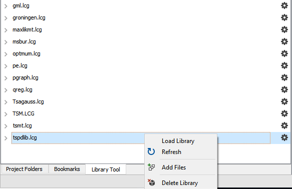

# gauss-panel-library
[![alt text][1.1]][1]
[![alt text][2.1]][2]
[![alt text][3.1]][3]

# GAUSS panel data library
This is an early stage library of panel data procedures for estimation and data management. The program are in pre-release form and as such there is no library folder for installation yet.

## Getting Started
### Prerequisites
The program files require a working copy of **GAUSS 18+**. Many can be run on earlier versions with some small revisions.

### Installation
The GAUSS Time Series and Panel data tests can be easily installed using the **GAUSS Application Installer**, as shown below:

1. Download the zipped folder `tspdlib.zip`.
2. Select **Tools > Install Application** from the main **GAUSS** menu.  
  
3. Follow the installer prompts, making sure to navigate to the downloaded `pdlib.zip`.
4. Before using the functions created by `pdlib` you will need to load the newly created `pdlib` library. This can be done in a number of ways:
  *   Navigate to the library tool view window and click the small wrench located next to the `pdlib` library. Select `Load Library`.  
  
  *  Enter `library pdlib` in the program input/output window.
  *  Put the line `library pdlib;` at the beginning of your program files.

  Note: I have provided the individual files found in `pdlib.zip` for examination and review. However, installation should always be done using the `pdlib.zip` folder and the **GAUSS Application Installer**.

## Example files
Six example files are included:
1. [between_grunfeld.e](examples/between_grunfeld.e) - This file demonstrates the use of the procedure `between` to compute between group estimates using the Grunfeld dataset (1958).
2. [fe_grunfeld.e](examples/fe_grunfeld.e) - This file demonstrates the use of the procedure `fixedEffects` to estimate a Fixed Effects model using the Grunfeld dataset (1958).
3. [panel_grunfeld.e](examples/panel_grunfeld.e) - This file demonstrates the use of the procedure `panel` to estimate the fixed effects, random effects, between group, and pooled OLS models using the Grunfeld dataset (1958).
4. [pdwide.e](examples/pdwide.e) - This file demonstrates the use of the procedure `pdwide` to change the orientation of a panel dataset from long to wide.
5. [pooled_grunfeld.e](examples/pooled_grunfeld.e) - This file demonstrates the use of the procedure `pooledOLS` to estimate a pooled OLS model using the Grunfeld dataset (1958).
6. [re_grunfeld.e](examples/re_grunfeld.e) - This file demonstrates the use of the procedure `randomEffects` to estimate a Random Effects model using the Grunfeld dataset (1958).

## Authors
[Erica Clower](mailto:eclower@aptech.com)  
[Aptech Systems, Inc](https://www.aptech.com/)  
[![alt text][1.1]][1]
[![alt text][2.1]][2]
[![alt text][3.1]][3]

<!-- links to social media icons -->
[1.1]: https://www.aptech.com/wp-content/uploads/2019/02/fb.png (Visit Aptech Facebook)
[2.1]: https://www.aptech.com/wp-content/uploads/2019/02/gh.png (Aptech Github)
[3.1]: https://www.aptech.com/wp-content/uploads/2019/02/li.png (Find us on LinkedIn)

<!-- links to your social media accounts -->
[1]: https://www.facebook.com/GAUSSAptech/
[2]: https://github.com/aptech
[3]: https://linkedin.com/in/ericaclower
<!-- Please don't remove this: Grab your social icons from https://github.com/carlsednaoui/gitsocial -->
